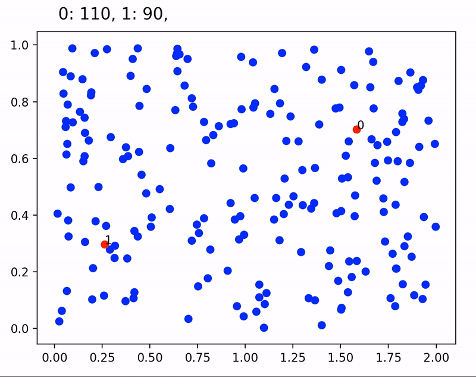
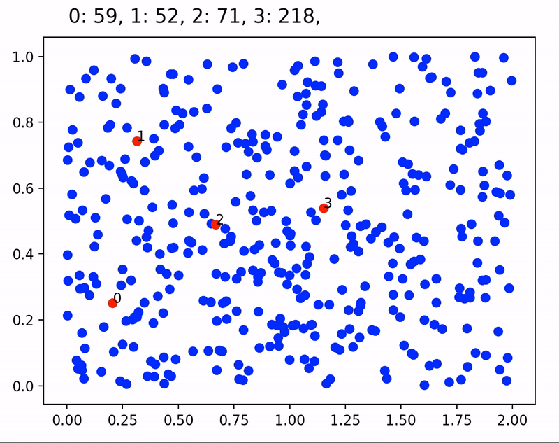

# game-theory-client-vendor

This code is a small experiment to test a game theory problem described in this video https://youtu.be/jILgxeNBK_8

The main question to ask is, 
> why do competitor bussiness tend to be together in the same geographicall position?

### Methods

This code gives n vendors the chance to steal competitor's clients. On each step they attempt a finite number of random moves and only execute the one that results in getting more costumers. The simulation shows that equilibrium is reached when they are together back to back at the center of the area

### Two vendors demo

  

With more vendors things get more interesting. With exactly 4 vendors, they tend to pair and split the area evenly

### Four vendors demo

  

